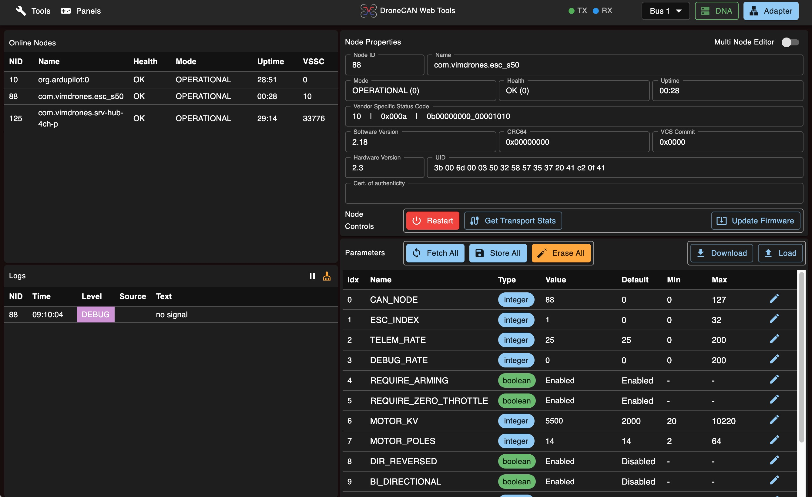

# DroneCAN-Webtools



A web-based tool for DroneCAN configuration and monitoring. This application provides multiple panels for interacting with DroneCAN nodes including bus monitoring, ESC control, actuator control, and parameter management.

## Access

**Official Entry**: https://can.vimdrones.com

**Backup Entry**: https://can.vimdrones.com

## Features

- **Bus Monitor**: Monitor DroneCAN bus traffic and messages
- **ESC Panel**: Control and configure Electronic Speed Controllers
- **Actuator Panel**: Control and test actuators
- **Subscriber**: Subscribe to specific DroneCAN messages
- **Node Configuration**: Manage node parameters and settings

## Prerequisites

- Node.js (version 14 or higher)
- npm or yarn package manager

## Installation

1. Clone the repository:
   ```bash
   git clone https://github.com/VimDrones/dronecan-webtools.git
   cd dronecan-webtools
   ```

2. Install dependencies:
   ```bash
   npm install
   ```

## Running the Application

### Development Mode

To start the development server with hot reload:

```bash
npm start
```

The application will be available at `http://localhost:8080`

### Production Build

To create a production build:

```bash
npm run build
```

The built files will be generated in the `dist` directory.

### Update dronecan.js
```bash
git clone https://github.com/dronecan/dronecan_dsdljs
cd dronecan_dsdljs
./dronecan_dsdljs.py ../DSDL/dronecan ../DSDL/ardupilot ../DSDL/uavcan ../DSDL/com --output ../dronecan-webtools/src/dronecan # adjust path in your case
```

## Application Structure

The application consists of multiple entry points:

- **Main Application** (`/`): Primary interface with navigation to all tools
- **Bus Monitor** (`/bus_monitor.html`): Real-time DroneCAN message monitoring
- **ESC Panel** (`/esc_panel.html`): ESC configuration and control
- **Actuator Panel** (`/actuator_panel.html`): Actuator testing and control
- **Subscriber** (`/subscriber.html`): Message subscription interface

## Usage

1. Start the development server using `npm start`
2. Open your web browser and navigate to `http://localhost:8080`
3. Connect to your DroneCAN bus using the connection settings
4. Use the various panels to monitor and control your DroneCAN devices

## Development

This project uses:
- React 18 for the UI framework
- Material-UI for components
- Webpack 5 for bundling
- Babel for JavaScript transpilation

The development server runs on port 8080 with hot module replacement enabled.